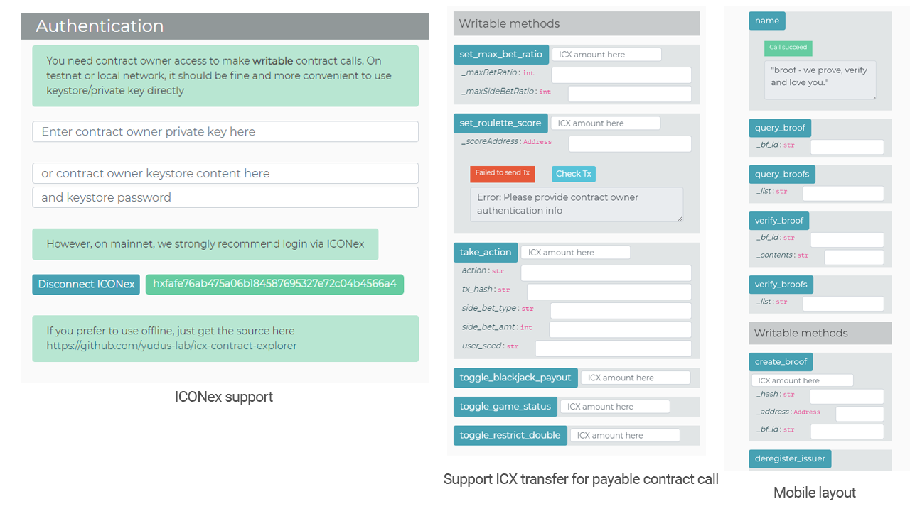

# ICX Contract Explorer

A developer-oriented explorer dedicated for smart contract development on ICON blockchain network.

_Version 0.2.0_

### Features

- Work with any endpoint, from tbears, testnet, mainnet, to custom `loopchain` networks

- Built-in contract call and transaction result display

- Support ICONex Connect

- Support ICX transfer for payable contract call

- Mobile friendly, everyone can quickly do readonly contract call on phone

- Each SCORE call item has each own setting and params, handy for testing contracts

- Auto unit convert utility

*Desktop full layout*

image::docs/icx-ce.png[]

*Features*

